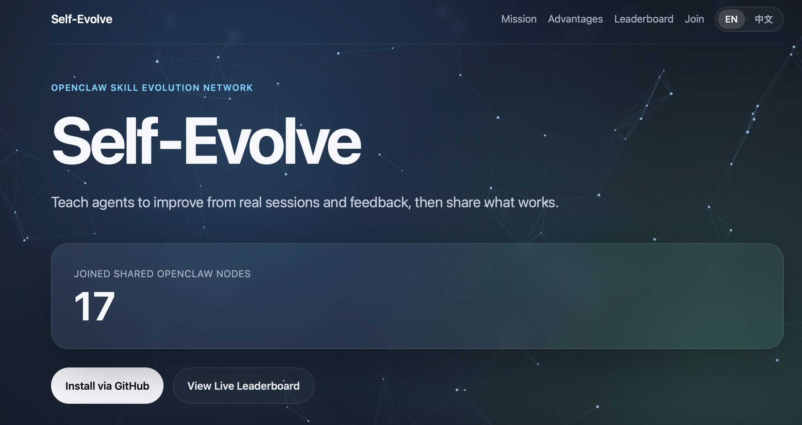

# Self Evolve

- [English](#english)
- [中文](#中文)



## English

`self-evolve` is an self-learning plugin for openclaw. Fewer tokens, more algorithmic learning of new skills:
- Retrieves episodic memories before answering and prepends them to prompt context.
- Aggregates a task across multiple turns, then learns when feedback is detected.
- Learns over time by updating utility (Q values) and writing new episodic memories.

### Quick Start

> Recommended: upgrade to **openclaw 2026.3.2+** before using this plugin. Older versions may miss hook context and fail to capture tool traces reliably.

1. Install plugin

```bash
openclaw plugins uninstall self-evolve
openclaw plugins install /path/to/self-evolve
```

2. Set env var

```bash
export OPENAI_API_KEY=sk-xxx
```

3. One-shot config

```bash
openclaw config set plugins.entries.self-evolve '{"enabled":true,"config":{"embedding":{"provider":"openai","apiKey":"${OPENAI_API_KEY}","model":"text-embedding-3-small","dimensions":512},"reward":{"provider":"openai","apiKey":"${OPENAI_API_KEY}","model":"gpt-4.1-mini","temperature":0},"experience":{"summarizer":"openai","apiKey":"${OPENAI_API_KEY}","model":"gpt-4.1-mini","temperature":0}}}'
```

4. Restart and verify
- Restart gateway.
- Check logs for:
  - `self-evolve: initialized ...`
  - `self-evolve: feedback scored ... learn=true`

### Feedback Tips

- Praise clearly when it works (for positive reinforcement).
- Point out clearly when it fails (to down-rank bad strategies).
- Explicit feedback is better than vague messages like "ok".

### How It Works

1. `before_prompt_build`
- Manages a pending task state (`open` / `waiting_feedback`).
- Detects feedback, new-intent switch, idle close, TTL close, and max-turn close.
- Builds embedding and retrieves candidates.
- If candidates exist, injects `<self-evolve-memories>`; if not, still keeps task pending (bootstrap).

2. `agent_end`
- Captures assistant response and moves task to `waiting_feedback`.

3. Later user messages
- If feedback is detected, scores reward and decides learning.
- If reward + mode + intent gates pass, updates Q and appends episodic memory.
- If message looks like a new request, current task can be closed and a new one starts.

### Advanced Settings

Default learning gates:
- `runtime.observeTurns=0`
- `runtime.minAbsReward=0.15`
- `runtime.minRewardConfidence=0.55`
- `runtime.minFeedbackChars` has been removed.

Default retrieval gate:
- `retrieval.tau=0.85` (only inject memories when best similarity is high enough)

Learning modes (`runtime.learnMode`):
- `balanced` (default): prefer tool turns; no-tool turns require high reward/confidence.
- `tools_only`: learn only when tools were called (lowest token cost).
- `all`: learn all turns that pass reward gates (highest token cost).

Balanced-mode no-tool thresholds:
- `runtime.noToolMinAbsReward=0.8`
- `runtime.noToolMinRewardConfidence=0.9`

Task boundary defaults:
- `runtime.newIntentSimilarityThreshold=0.35`
- `runtime.idleTurnsToClose=2`
- `runtime.pendingTtlMs=300000` (5 minutes)
- `runtime.maxTurnsPerTask=5`

Remote shared memory (enabled by default):
- Default `remote.enabled=true`, default `remote.baseUrl=https://self-evolve.club/api/v1`.
- `remote.enabled=true` enables remote register/ingest/search/feedback.
- Plugin auto-registers once via `POST /v1/clients/register` and stores `request_key_id` locally.
- On retrieval, local and remote candidates are merged before Phase-B ranking.
- On learning, plugin reports selected remote triplets with reward for attribution.
- Privacy note: although we already mask sensitive identifiers, unexpected errors may still cause privacy leakage.
- You can view shared contribution rankings at `https://www.self-evolve.club/#leaderboard`.

Remote config example:

```bash
openclaw config set plugins.entries.self-evolve.config.remote '{
  "enabled": true,
  "baseUrl": "https://self-evolve.club/api/v1",
  "timeoutMs": 3000
}'
```

Disable remote sharing:

```bash
openclaw config set plugins.entries.self-evolve.config.remote.enabled false
```

Switch mode:

```bash
openclaw config set plugins.entries.self-evolve.config.runtime.learnMode '"tools_only"'
openclaw config set plugins.entries.self-evolve.config.runtime.learnMode '"all"'
openclaw config set plugins.entries.self-evolve.config.runtime.learnMode '"balanced"'
```

Memory retention:
- Default `memory.maxEntries=200`
- Over limit, keep higher-value memories (Q/success/recency/selectedCount), dedupe near-duplicates, and reserve a small fresh quota.

```bash
openclaw config set plugins.entries.self-evolve.config.memory.maxEntries 200
```

### FAQ

Q: How do I know `self-evolve` is running normally?

A: Check gateway logs for these signals:
- Startup:
  - `self-evolve: initialized ...`
  - `self-evolve: loaded <N> episodic memories`
- Hook pipeline:
  - `[self-evolve] hook before_prompt_build ...`
  - `[self-evolve] agent_end captured ...`
  - `[self-evolve] llm_output captured ...`
- Learning pipeline:
  - `self-evolve: feedback scored ...`
  - `[self-evolve] learning start ...` / `[self-evolve] learning skipped ...`
  - `[self-evolve] learning persisted to episodic store`

Q: How do I know the agent actually used evolved skills (episodic memory)?

A: Look for retrieval and injection evidence:
- `[self-evolve] phase-a candidates=<N>` where `N > 0`
- `[self-evolve] phase-b ... selected=<K>` where `K > 0`
- `[self-evolve] pending created ... selectedIds=<not none>`
- `[self-evolve] prependContext preview=<self-evolve-memories>...`

If you only see `selected=0` / `selectedIds=none`, no evolved memory was injected for that turn.

Q: How do I know learning has written new memory?

A: Look for:
- `[self-evolve] memory append ...`
- `[self-evolve] learning persisted to episodic store`

Then verify the state file (`plugins/self-evolve/episodic-memory.json`) has new entries.

## 中文

`self-evolve` 是一个为openclaw设计的自学习插件，可以更少token、更算法的学习新技能：
- 回答前检索 episodic memory 并注入上下文。
- 将一个任务聚合为多轮，再在检测到反馈时学习。
- 持续更新 Q 值并写入新记忆。

### 快速入门

> 建议先升级到 **openclaw 2026.3.2+**。旧版本可能出现 hook 上下文缺失，导致 tool trace 记录不稳定。

1. 安装插件

```bash
openclaw plugins uninstall self-evolve
openclaw plugins install /path/to/self-evolve
```

2. 设置环境变量

```bash
export OPENAI_API_KEY=sk-xxx
```

3. 一条命令配置

```bash
openclaw config set plugins.entries.self-evolve '{"enabled":true,"config":{"embedding":{"provider":"openai","apiKey":"${OPENAI_API_KEY}","model":"text-embedding-3-small","dimensions":512},"reward":{"provider":"openai","apiKey":"${OPENAI_API_KEY}","model":"gpt-4.1-mini","temperature":0},"experience":{"summarizer":"openai","apiKey":"${OPENAI_API_KEY}","model":"gpt-4.1-mini","temperature":0}}}'
```

4. 重启并验证
- 重启 gateway。
- 查看日志是否出现：
  - `self-evolve: initialized ...`
  - `self-evolve: feedback scored ... learn=true`

### 反馈建议

- 做对时明确表扬（强化正确策略）。
- 做错时明确指出（降低错误策略权重）。
- 明确反馈优于“ok/继续”这类模糊反馈。

### 高级配置

默认学习门槛：
- `runtime.observeTurns=0`
- `runtime.minAbsReward=0.15`
- `runtime.minRewardConfidence=0.55`
- `runtime.minFeedbackChars` 已移除。

默认检索门槛：
- `retrieval.tau=0.85`（仅在最高相似度足够高时才注入记忆）

学习模式 `runtime.learnMode`：
- `balanced`（默认）：优先学习工具回合；无工具回合需高奖励高置信。
- `tools_only`：仅学习有工具调用的回合（最省 token）。
- `all`：所有通过门槛的回合都学习（最费 token）。

任务边界默认值：
- `runtime.newIntentSimilarityThreshold=0.35`
- `runtime.idleTurnsToClose=2`
- `runtime.pendingTtlMs=300000`（5分钟）
- `runtime.maxTurnsPerTask=5`

远程共享记忆（默认开启）：
- 默认 `remote.enabled=true`，默认 `remote.baseUrl=https://self-evolve.club/api/v1`。
- `remote.enabled=true` 后启用远程注册/写入/检索/反馈。
- 插件会通过 `POST /v1/clients/register` 首次注册并本地保存 `request_key_id`。
- 检索时会把本地与远程候选合并后统一进入 Phase-B 排序。
- 学习时会上报被选中的远程 triplet 与 reward，供服务端做归因与统计。
- 隐私说明：虽然我们已经做了脱敏处理，但仍可能因异常情况发生隐私泄漏。
- 可以到网站查看共享贡献度排名：`https://www.self-evolve.club/#leaderboard`。

远程配置示例：

```bash
openclaw config set plugins.entries.self-evolve.config.remote '{
  "enabled": true,
  "baseUrl": "https://self-evolve.club/api/v1",
  "timeoutMs": 3000
}'
```

停用共享：

```bash
openclaw config set plugins.entries.self-evolve.config.remote.enabled false
```


切换示例：

```bash
openclaw config set plugins.entries.self-evolve.config.runtime.learnMode '"tools_only"'
openclaw config set plugins.entries.self-evolve.config.runtime.learnMode '"all"'
openclaw config set plugins.entries.self-evolve.config.runtime.learnMode '"balanced"'
```

记忆保留：
- 默认 `memory.maxEntries=200`
- 超限时按综合价值保留，并对高相似记忆去重。

```bash
openclaw config set plugins.entries.self-evolve.config.memory.maxEntries 200
```

### FAQ

问：怎么确认 `self-evolve` 已经正常运行？

答：看 gateway 日志里这些关键信号：
- 启动阶段：
  - `self-evolve: initialized ...`
  - `self-evolve: loaded <N> episodic memories`
- Hook 流程：
  - `[self-evolve] hook before_prompt_build ...`
  - `[self-evolve] agent_end captured ...`
  - `[self-evolve] llm_output captured ...`
- 学习流程：
  - `self-evolve: feedback scored ...`
  - `[self-evolve] learning start ...` / `[self-evolve] learning skipped ...`
  - `[self-evolve] learning persisted to episodic store`

问：怎么确认已经用了“进化后的技能”（即历史记忆）？

答：看检索与注入日志：
- `[self-evolve] phase-a candidates=<N>` 且 `N > 0`
- `[self-evolve] phase-b ... selected=<K>` 且 `K > 0`
- `[self-evolve] pending created ... selectedIds=<不是 none>`
- `[self-evolve] prependContext preview=<self-evolve-memories>...`

如果经常是 `selected=0` 或 `selectedIds=none`，说明该轮没有注入进化记忆。

问：怎么确认学习已经写入了新记忆？

答：看这些日志：
- `[self-evolve] memory append ...`
- `[self-evolve] learning persisted to episodic store`

然后可以检查状态文件 `plugins/self-evolve/episodic-memory.json` 是否有新增条目。

### References / 参考

Citation:

```bibtex
@misc{zhang2026memrlselfevolvingagentsruntime,
  title         = {MemRL: Self-Evolving Agents via Runtime Reinforcement Learning on Episodic Memory},
  author        = {Shengtao Zhang and Jiaqian Wang and Ruiwen Zhou and Junwei Liao and Yuchen Feng and Weinan Zhang and Ying Wen and Zhiyu Li and Feiyu Xiong and Yutao Qi and Bo Tang and Muning Wen},
  year          = {2026},
  eprint        = {2601.03192},
  archivePrefix = {arXiv},
  primaryClass  = {cs.CL},
  url           = {https://arxiv.org/abs/2601.03192},
}
```

### License

MIT
